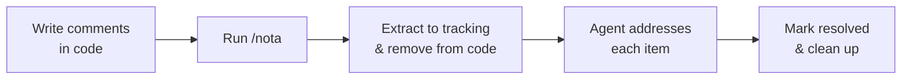

# nota

A code review annotation tool for use with AI agents. Leave structured review comments in your source code, and let your AI agent extract, track, and address them.

## Table of Contents

- [How It Works](#how-it-works)
- [Comment Syntax](#comment-syntax)
- [Installation](#installation)
- [Commands](#commands)
- [Tracking Files](#tracking-files)
- [Extensions](#extensions)
- [Supported Languages](#supported-languages)
- [CLI Usage](#cli-usage)
- [License](#license)

## How It Works

1. You leave review comments directly in your source code
2. Run `/nota` — comments are extracted into tracking files (`.nota/`) and removed from source code
3. The agent reads each item and addresses it — fixing bugs, explaining decisions, or discussing tradeoffs
4. Resolved items are marked in the tracking file
5. Once done, clean up the tracking files



## Comment Syntax

Add review comments using your language's comment syntax with a tag prefix:

```go
// review: this function silently swallows errors
// review(auth): check token expiry before proceeding
// discuss: should we use a mutex here instead?
// explain: why does this retry 3 times?
```

### Tags

These tags are built in. Run `nota behavior` to see the full list with descriptions, or `nota behavior <tag>` for details on a specific tag.

| Tag | Purpose |
|-----|---------|
| `review` | Bug or issue — the agent fixes it and proposes resolution |
| `discuss` | Needs debate — the agent presents options, waits for agreement |
| `explain` | Wants reasoning — the agent explains, may lead to discussion or change |
| `impl` | Implementation request — the agent writes the code at the annotated location |
| `refactor` | Refactoring — the agent restructures code, preserving behavior |
| `critique` | Critical review — the agent challenges assumptions, finds edge cases |
| `propose` | Request alternatives — the agent suggests options with tradeoffs |
| `test` | Test request — the agent writes tests for the annotated code |
| `doc` | Documentation — the agent writes or improves docs |
| `see` | Cross-reference to a named group (no message) |
| `also` | Cross-reference to a named group (no message) |

You can override any built-in tag or add custom ones. See [Extensions](#extensions).

### Grouping

Use a name in parentheses to group related comments:

```python
# review(auth): validate tokens before storing
def store_token(token):
    db.save(token)

# review(auth): same issue here — no validation
def refresh_token(token):
    db.update(token)
```

Both comments are grouped under `auth` and tracked together.

### Multi-line Comments

Block comments:

Go/C/C++/Rust/Java... :

```go
/* review(perf): this allocates on every call
   consider using a sync.Pool or pre-allocating
   the buffer outside the loop */
```

Consecutive line comments are merged automatically:

Go/C/C++/Rust/Java... :

```go
// review(auth): token validation is missing here
// we need to check expiry and verify the signature
// before granting access
```

Bash/Python/...

```bash
# review(deploy): this assumes the container is already running
# add a health check before calling the endpoint
```

SQL:

```sql
-- review(query): this full table scan needs an index
-- add a composite index on (user_id, created_at)
```

HTML/Markdown:

```markdown
<!-- review(docs): this section is outdated
     the API changed in v2, update the examples -->
```

## Installation

### Claude Code Plugin

Add the marketplace and install the plugin in Claude Code:

```text
/plugin marketplace add urso/nota
/plugin install nota@urso/nota
```

### From Source

If you clone the repository, load the plugin directly:

```bash
claude --plugin-dir /path/to/nota
```

Or add it as a local marketplace for permanent installation:

```text
/plugin marketplace add /path/to/nota
/plugin install nota@nota-plugins
```

### CLI (Optional)

The CLI can be used standalone outside of Claude Code. Requires Go:

```bash
go install github.com/urso/nota/cmd/nota@latest
```

Run `nota --help` for usage.

## Commands

All commands are available as slash commands in Claude Code after installing the plugin.

### `/nota`

The main workflow. Extracts new comments from code, reads open reviews, and addresses each item. The agent triages by tag type — fixing `review` items, discussing `discuss` items, and explaining `explain` items. Pass an optional directive to focus on specific groups or items.

```text
/nota focus on auth group
```

### `/nota-list`

Peek at review comments in code without extracting. Read-only.

```text
/nota-list --staged
```

### `/nota-delete`

Delete all review comments from source code permanently without saving them. Asks for confirmation first.

### `/nota-evaluate`

Get a second opinion on your review comments. The agent critically evaluates each item and tells you if it's valid, questionable, a false positive, or a nitpick. No code changes are made.

### `/nota-status`

Overview of all tracking files — open, resolved, and wontfix counts per file.

### `/nota-cleanup`

Remove tracking files that have `status: resolved`. Asks for confirmation.

## Tracking Files

Extracted comments are saved to `.nota/` in your repo root as markdown files with YAML frontmatter:

```markdown
---
status: open
group: auth
---

## review — handlers/auth.go:42
> check token expiry before proceeding

### Code context
​```go
    token := getToken()
    return token.Valid()
​```

## [resolved] review — handlers/auth.go:78
> Fixed: added expiry check before storing
```

- Named groups produce files like `auth.md`
- Unnamed comments produce `review-001.md`, `review-002.md`, etc.
- Sections are marked `[resolved]` or `[wontfix]` when addressed
- File status changes to `resolved` when all sections are complete

A validation hook runs automatically after edits to `.nota/` files to catch formatting errors.

## Extensions

Tags are defined as YAML files. You can override built-in tags or create custom ones by adding `.yaml` files to your extension directories.

### Lookup Order

1. **Local** — `.nota/extensions/<tag>.yaml` in your repo root
2. **Global** — `$HOME/.config/nota/extensions/<tag>.yaml`
3. **Embedded** — built-in defaults bundled with the binary

Local fully replaces global, global fully replaces embedded. No merging.

### Extension Format

```yaml
tag: mytag
behavior: |
  Describe the agent's posture when handling this tag.
  This text is shown to the agent to guide its behavior.
```

The `tag` field must match the filename (without `.yaml`). Tag names must be lowercase and match `[a-z][a-z0-9_-]*`.

### Example: Custom Tag

Create `.nota/extensions/security.yaml` in your repo:

```yaml
tag: security
behavior: |
  Audit the annotated code for security vulnerabilities. Check for
  injection, authentication bypass, data exposure, and OWASP top 10
  issues. Flag findings with severity.
```

Now you can use `// security(auth): check for timing attacks` in your code.

### Querying Behaviors

```bash
# List all known tags and their behaviors
nota behavior

# Show behavior for a specific tag
nota behavior impl
```

## Supported Languages

nota detects file languages automatically and understands their comment syntax. It supports 64 languages including:

Go, Python, JavaScript, TypeScript, Java, C, C++, C#, Rust, Ruby, PHP, Shell, SQL, Swift, Kotlin, Scala, Lua, Perl, Haskell, Elixir, Erlang, Clojure, Dart, OCaml, R, Julia, Vim Script, and more.

Both line comments (`//`, `#`, `--`) and block comments (`/* */`, `{- -}`, `(* *)`) are supported. String literals are recognized to avoid false positives.

## CLI Usage

The CLI can also be used standalone outside of Claude Code:

```bash
# List comments (read-only)
nota list --all
nota list --staged
nota list path/to/file.go

# Extract comments to tracking files
nota extract --dir .nota --all

# Delete comments from source code
nota delete --all

# Query tag behaviors
nota behavior          # list all tags
nota behavior review   # show behavior for a specific tag
```

### Scope Flags

| Flag | Scope |
|------|-------|
| `--all` | All tracked files in the repo |
| `--staged` | Staged files only |
| `--unstaged` | Unstaged and untracked files |
| `--modified` | Staged, unstaged, and untracked files |

### Format Options

```bash
nota list --format markdown   # default
nota list --format yaml
nota list --context 5         # lines of context (default: 3)
```
