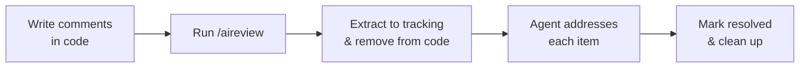

# aireview

A code review tool for AI agents. Leave structured review comments in your source code, and let your AI agent extract, track, and address them.

## Table of Contents

- [How It Works](#how-it-works)
- [Comment Syntax](#comment-syntax)
- [Installation](#installation)
- [Commands](#commands)
- [Tracking Files](#tracking-files)
- [Supported Languages](#supported-languages)
- [CLI Usage](#cli-usage)
- [License](#license)

## How It Works

1. You leave review comments directly in your source code
2. Run `/aireview` — comments are extracted into tracking files (`.aireview/`) and removed from source code
3. The agent reads each item and addresses it — fixing bugs, explaining decisions, or discussing tradeoffs
4. Resolved items are marked in the tracking file
5. Once done, clean up the tracking files



## Comment Syntax

Add review comments using your language's comment syntax with a tag prefix:

```go
// review: this function silently swallows errors
// review(auth): check token expiry before proceeding
// discuss: should we use a mutex here instead?
// explain: why does this retry 3 times?
```

### Tags

| Tag | Purpose |
|-----|---------|
| `review` | Bug or issue — the agent should fix it |
| `discuss` | Needs debate — the agent presents options, waits for your input |
| `explain` | Wants reasoning — the agent explains the code's logic |
| `see` | Cross-reference to a named group (no message) |
| `also` | Cross-reference to a named group (no message) |

### Grouping

Use a name in parentheses to group related comments:

```python
# review(auth): validate tokens before storing
def store_token(token):
    db.save(token)

# review(auth): same issue here — no validation
def refresh_token(token):
    db.update(token)
```

Both comments are grouped under `auth` and tracked together.

### Multi-line Comments

Block comments:

Go/C/C++/Rust/Java... :

```go
/* review(perf): this allocates on every call
   consider using a sync.Pool or pre-allocating
   the buffer outside the loop */
```

Consecutive line comments are merged automatically:

Go/C/C++/Rust/Java... :

```go
// review(auth): token validation is missing here
// we need to check expiry and verify the signature
// before granting access
```

Bash/Python/...

```bash
# review(deploy): this assumes the container is already running
# add a health check before calling the endpoint
```

SQL:

```sql
-- review(query): this full table scan needs an index
-- add a composite index on (user_id, created_at)
```

HTML/Markdown:

```markdown
<!-- review(docs): this section is outdated
     the API changed in v2, update the examples -->
```

## Installation

### Claude Code Plugin

Add the marketplace and install the plugin in Claude Code:

```text
/plugin marketplace add urso/aireview
/plugin install aireview@urso/aireview
```

### From Source

If you clone the repository, load the plugin directly:

```bash
claude --plugin-dir /path/to/aireview
```

Or add it as a local marketplace for permanent installation:

```text
/plugin marketplace add /path/to/aireview
/plugin install aireview@aireview-plugins
```

### CLI (Optional)

The CLI can be used standalone outside of Claude Code. Requires Go:

```bash
go install github.com/urso/aireview/cmd/aireview@latest
```

Run `aireview --help` for usage.

## Commands

All commands are available as slash commands in Claude Code after installing the plugin.

### `/aireview`

The main workflow. Extracts new comments from code, reads open reviews, and addresses each item. The agent triages by tag type — fixing `review` items, discussing `discuss` items, and explaining `explain` items. Pass an optional directive to focus on specific groups or items.

```text
/aireview focus on auth group
```

### `/aireview-list`

Peek at review comments in code without extracting. Read-only.

```text
/aireview-list --staged
```

### `/aireview-delete`

Delete all review comments from source code permanently without saving them. Asks for confirmation first.

### `/aireview-evaluate`

Get a second opinion on your review comments. The agent critically evaluates each item and tells you if it's valid, questionable, a false positive, or a nitpick. No code changes are made.

### `/aireview-status`

Overview of all tracking files — open, resolved, and wontfix counts per file.

### `/aireview-cleanup`

Remove tracking files that have `status: resolved`. Asks for confirmation.

## Tracking Files

Extracted comments are saved to `.aireview/` in your repo root as markdown files with YAML frontmatter:

```markdown
---
status: open
group: auth
---

## review — handlers/auth.go:42
> check token expiry before proceeding

### Code context
​```go
    token := getToken()
    return token.Valid()
​```

## [resolved] review — handlers/auth.go:78
> Fixed: added expiry check before storing
```

- Named groups produce files like `auth.md`
- Unnamed comments produce `review-001.md`, `review-002.md`, etc.
- Sections are marked `[resolved]` or `[wontfix]` when addressed
- File status changes to `resolved` when all sections are complete

A validation hook runs automatically after edits to `.aireview/` files to catch formatting errors.

## Supported Languages

aireview detects file languages automatically and understands their comment syntax. It supports 64 languages including:

Go, Python, JavaScript, TypeScript, Java, C, C++, C#, Rust, Ruby, PHP, Shell, SQL, Swift, Kotlin, Scala, Lua, Perl, Haskell, Elixir, Erlang, Clojure, Dart, OCaml, R, Julia, Vim Script, and more.

Both line comments (`//`, `#`, `--`) and block comments (`/* */`, `{- -}`, `(* *)`) are supported. String literals are recognized to avoid false positives.

## CLI Usage

The CLI can also be used standalone outside of Claude Code. It has three subcommands:

```bash
# List comments (read-only)
aireview list --all
aireview list --staged
aireview list path/to/file.go

# Extract comments to tracking files
aireview extract --dir .aireview --all

# Delete comments from source code
aireview delete --all
```

### Scope Flags

| Flag | Scope |
|------|-------|
| `--all` | All tracked files in the repo |
| `--staged` | Staged files only |
| `--unstaged` | Unstaged and untracked files |
| `--modified` | Staged, unstaged, and untracked files |

### Format Options

```bash
aireview list --format markdown   # default
aireview list --format yaml
aireview list --context 5         # lines of context (default: 3)
```
